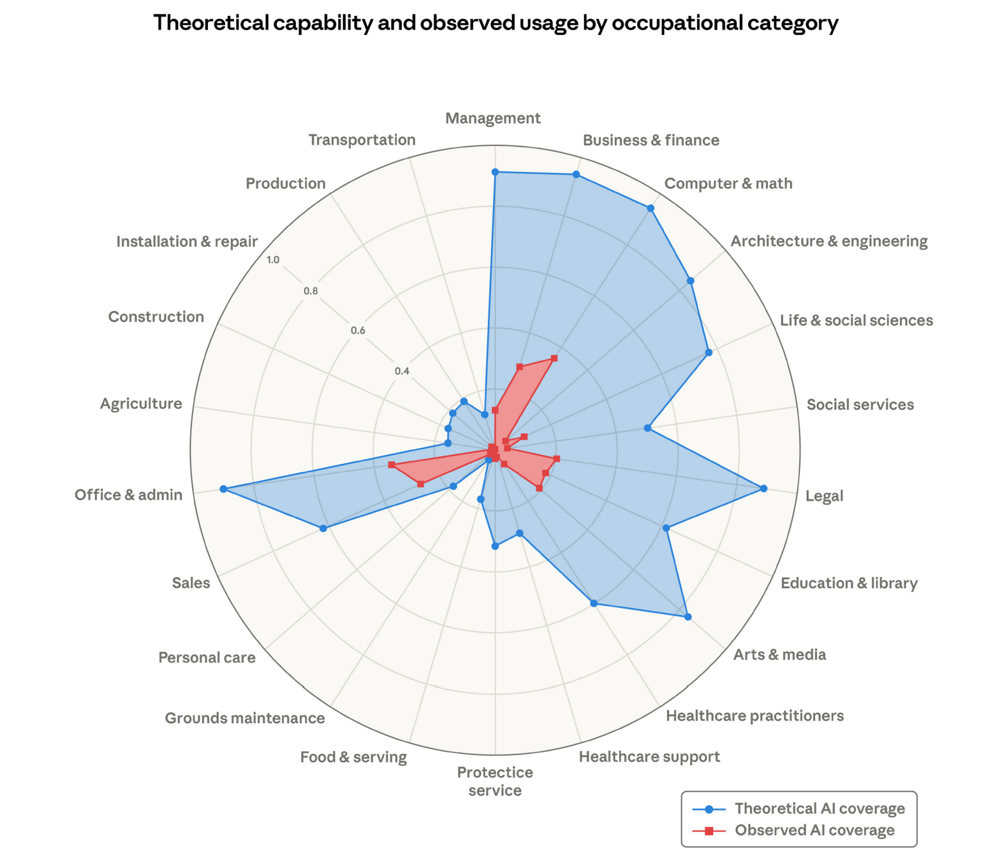
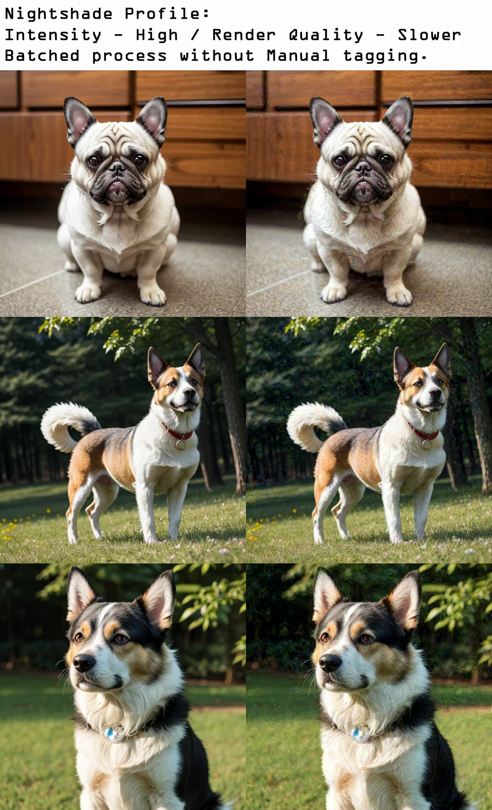
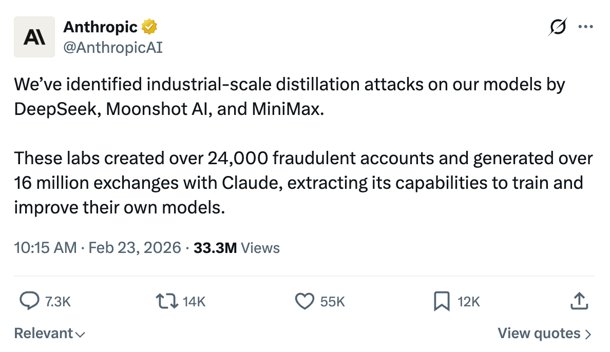

# What Do We Mean By Ethics and Intellectual Property?

## What Do We Mean By Ethics and Intellectual Property?

- **Ethics**: How AI systems can encode bias, resist accountability, enable manipulation, reshape labor markets, and impact the environment
- **Intellectual Property**: Who owns training data, model weights, and AI-generated content, and what the courts are still figuring out

## What Do We Mean By Ethics and Intellectual Property?

- My goal is not to convince you one way or another on any of these topics
- Instead, present evidence, promote dialog and investigation in order to reach your own conclusions

# Section 1: Ethics

## Ethics

- The training and use of AI models as it applies to:
  - Bias and Fairness
  - Manipulative Content
  - Labor and Socioeconomic
  - Environmental Concerns

# Bias and Fairness

## Bias and Fairness

- Training data (used for pretraining) often contains societal biases
- These biases influence how models respond:
  - Often in more subtle ways or where input data contains diverse demographic details
- Why it happens
  - Not accidental malice, but a mathematical inevitability
  - Models learn statistical patterns from data. If the data reflects historical inequities, the model will too.

## Examples

- [**Workday AI Hiring Bias Lawsuit: Mobley v. Workday**](https://www.quinnemanuel.com/the-firm/publications/when-machines-discriminate-the-rise-of-ai-bias-lawsuits/){.external target="_blank"}: 
  - A Black job seeker over 40 with a disability sued Workday, alleging its AI applicant-screening system systematically rejected him based on race, age, and disability
  - In May 2025, a federal judge allowed the case to move forward (as a class action)
  - Plausible that Workday's tools violate the Age Discrimination in Employment Act (ADEA)

## Examples

- [**AI Salary Negotiation Bias**](https://www.computerworld.com/article/4028148/bias-alert-llms-suggest-women-seek-lower-salaries-than-men-in-job-interviews.html){.external target="_blank"}: 
  - Researchers at a technical university in Germany found that when LLMs including GPT-4o mini, Claude 3.5 Haiku, and others were asked to advise on salary negotiations, the chatbots recommended lower salaries to women and minority candidates compared to equally qualified white men.
  - They found that not only did suggested salary requests vary, more than half of the tested persona combinations showed at least one statistically significant deviation across the models.

## Examples

- [**Google Gemini's Image Generation**](https://blog.google/products-and-platforms/products/gemini/gemini-image-generation-issue/){.external target="_blank"}:
  - Google's Gemini model was generating historically inaccurate images — e.g., racially diverse Nazi soldiers — when users asked for images of historical figures.
  - While the Google blog post doesn't admit this, the alignment layer may have been over-compensating.

## How Can We Mitigate?

- Before Training: 
  - Sourcing of more balanced and representative datasets, intentionally oversampling underrepresented groups. Auditing for bias prior to training.
- During Training:
  - "Fairness constraints" built into the loss function. Elegant, but definition of "fair" can be subjective.

## How Can We Mitigate?

- Alignment (e.g., RLHF):
  - Where most of the foundational models focus their efforts. 
  - Human feedback to identify and down-weight biased output. 
  - [Anthropic's Constitutional AI](https://www.anthropic.com/constitution){.external target="_blank"} provides a good overview of their approach.

## How Can We Mitigate?

- Inference Time:
  - e.g., Injecting into the system prompt. Most brittle and non-deterministic.
- Auditing and Red-Teaming:
  - Independent bias audits to probe models for disparate outcomes across demographic groups.
    - [Google's PAIR "What-If Tool"](https://pair-code.github.io/what-if-tool/){.external target="_blank"}
    - [IBM AI Fairness 360](https://research.ibm.com/blog/ai-fairness-360){.external target="_blank"}

# What Do You Think?

Q: If an AI system is more accurate overall but biased against certain groups, should it still be used?

Q: Can "fairness" ever be universally defined, or is it always subjective?

# Manipulative Content

## Manipulative Content

- Synthetic media (deep fakes) across all mediums: text, images, video, audio
- Exploitation of psychological vulnerabilities for personal, financial, or political gain

## Examples

- [Personal](https://kathierobertslaw.com/protecting-seniors-from-ai-voice-cloning-scams-what-every-family-needs-to-know/){.external target="_blank"}:
  - Scammers are using AI voice cloning tools to impersonate family members in distress
  - Requires only a few seconds of audio scraped from social media
  - In a recent Florida case, a mother sent $15,000 after receiving a call from someone using her daughter's cloned voice claiming to be in an accident
  - She later discovered her daughter was safe and had never made the call

# Demo

The Accuracy of Qwen3-TTS for Voice Cloning

## Examples

- [Financial](https://www.theguardian.com/technology/article/2024/may/17/uk-engineering-arup-deepfake-scam-hong-kong-ai-video){.external target="_blank"}: 
  - In Jan 2024, fraudsters using deepfake technology impersonated a company's CFO on a video call, tricking an employee into transferring $25 million
  - The victim joined what appeared to be a legitimate multi-person video conference with colleagues and their CFO, all of whom were deepfake renderings

## Examples

- [Political](https://publications.lawschool.cornell.edu/jlpp/2025/10/24/the-legal-gray-zone-of-deepfake-political-speech/){.external target="_blank"}: 
  - A 2024 report by Recorded Future documented 82 pieces of AI-generated deepfake content targeting public figures across 38 countries in a single year
  - A survey conducted by the identity verification firm Jumio found that 72% of Americans believed deepfakes would influence elections

## How Can We Mitigate?

- Individual level: The "family safe word" has emerged as the most widely recommended mitigation for voice cloning scams specifically
  - i.e., a pre-agreed word or phrase that only genuine family members would know, used to verify identity before sending money

## How Can We Mitigate?

- Deepfake Detection Tech: An active area of research and development
  - Fundamentally a cat and mouse problem
  - Detection models are often trained on previous generations of fakes, and generative models tend to outpace them

## How Can We Mitigate?

- Cryptographic Watermarks: The Coalition for Content Provenance and Authenticity (C2PA) is developing open standards for embedding verifiable metadata into media at the point of creation (a cryptographic "certificate of authenticity" that travels with the file) 
  - Major camera manufacturers, Adobe, and several AI companies have signed on

## How Can We Mitigate?

- Cryptographic Watermarks: In Aug 2026, Anthropic announced text watermarks using statistical patterns based on the probability of the next token.
  - Google have also announced SynthID, a similar approach for text, images, and video.
  - Both approaches require the watermark to be injected by the model at the point of token generation

## How Can We Mitigate?

- Regulatory: The US TAKE IT DOWN Act (signed May 2025) criminalizes non-consensual intimate deepfakes at the federal level
  - The EU AI Act's deepfake labeling requirements became mandatory in August 2025
  - Enforcement is of course challenging

# What Do You Think?

Q: Can technology alone ever solve this problem?

Q: What obligation do platforms like YouTube and Meta have to label AI-generated political content?

# Labor and Socioeconomic

## Labor and Socioeconomic

- AI taking jobs, especially displacing creative workers
- Organizations restructuring roles due to AI
- Hidden labor behind AI (data labelers, content moderators)

## Examples

{.lightbox fig-align="center" width="600px"}

## Examples

- [Synthetic Performers](https://www.reuters.com/sustainability/sustainable-finance-reporting/hollywood-performers-union-condemns-ai-generated-actress-tilly-norwood-2025-10-01){.external target="_blank"}: 
  - A fully AI-generated “virtual actress” named Tilly Norwood
  - The Screen Actors Guild-American Federation of Television and Radio Artists (SAG-AFTRA) condemned the project, framing it as a threat to actors’ livelihoods and creative labor, especially since the character was trained on uncredited human performances.

# Video

[https://www.youtube.com/watch?v=qdYBwCwCtis](https://www.youtube.com/watch?v=qdYBwCwCtis){.external target="_blank"}

## Examples

- [Corporate Restructuring](https://econofact.org/factbrief/fact-check-has-ai-already-caused-some-job-displacement){.external target="_blank"}: 
  - In 2025–early 2026, major companies across tech and manufacturing cited AI as a reason for layoffs and workforce restructuring
  - In 2025, research firms attributed 17,000+ job cuts to AI, and another 20,000 to technological updates that likely include AI
  - Firms including Amazon, Dow, and Pinterest announced thousands of job cuts, in some cases explicitly linking AI investment or automation strategies to those decisions
  
## Examples

- [Hidden Labor](https://www.brookings.edu/articles/reimagining-the-future-of-data-and-ai-labor-in-the-global-south/?utm_source=chatgpt.com){.external target="_blank"}: 
  - Investigations and worker advocacy reports from late 2024–2025 documented how large-scale AI training relies on low-paid, outsourced human workers doing data labeling, content moderation, and safety tagging
  - Low wages, long hours, exposure to graphic content, and lack of mental health support
  - Worker surveys describe the effects of constant exposure to violent or disturbing material and minimal oversight

# What Do You Think?

Q: Where is the line between AI as a creative tool versus a replacement for human workers?

Q: Will AI job displacement follow the same pattern as past technological revolutions, or is this different?

# Environmental

## Environmental

- Training and running large AI models consumes significant energy and water
- The infrastructure required (data centers, hardware) has a measurable carbon footprint
- Demand is accelerating faster than the grid's ability to supply it from renewable sources

## Examples

- [Training Energy Costs](https://arxiv.org/abs/1906.02243){.external target="_blank"}: 
  - A 2019 University of Massachusetts study (Strubell et al.) estimated that training a large transformer model can emit as much CO₂ as five cars over their entire lifetimes (~300,000 lbs)
  - Since then, models have scaled by orders of magnitude
  - GPT-4 and its successors are estimated to have cost many multiples of that figure
  
## Examples

- [Data Center Water Use](https://www.theregister.com/2023/09/11/microsofts_ai_investments_skyrocketed_in/){.external target="_blank"}: 
  - Microsoft reported that its global water consumption increased 34% to 6.4 million cubic meters in 2022, largely attributed to AI infrastructure growth
  - Training GPT-3 alone is estimated to have evaporated 700,000 liters of freshwater for cooling
  - Datacenters are often located in water-stressed regions

## Examples

- [Grid Pressure](https://www.iea.org/reports/energy-and-ai/energy-demand-from-ai){.external target="_blank"}: 
  - The IEA projects global data center electricity consumption will roughly double to ~945 TWh by 2030, growing at ~15% per year
  - More than four times faster than all other sectors combined
  - In the US alone, data centers could account for up to 12% of national electricity demand by 2028, up from ~4% in 2023

## How Can We Mitigate?

- Efficient Architectures: Model distillation, quantization, and sparse architectures (e.g., Mixture of Experts) reduce compute and energy per inference
  - Smaller, task-specific models often perform comparably to large general-purpose ones

## How Can We Mitigate?

- [Intelligence per Watt (Stanford/Google, 2025)](https://arxiv.org/abs/2511.07885){.external target="_blank"}: Found that small local models can accurately answer 88.7% of real-world single-turn chat and reasoning queries
  - This would suggest most users don't need a frontier model for most tasks

## How Can We Mitigate?

- Renewable Energy Sourcing: Locating data centers near renewable energy supplies or signing long-term Power Purchase Agreements (PPAs) with renewable providers
  - Google, Microsoft, and Meta have all made public net-zero or renewable commitments
  - Although the definitions and timelines vary widely

## How Can We Mitigate?

- Transparency and Reporting: Requiring standardized disclosure of training compute, energy use, and water consumption, analogous to financial reporting
  - The EU AI Act includes provisions for environmental impact documentation for high-capability models

# What Do You Think?

Q: Is it ethical to train ever-larger models when the environmental cost is measurable and growing?

Q: If AI can help solve climate change (e.g., optimize energy grids, accelerate materials science), does that offset its own footprint?

# Section 2: Intellectual Property (IP)

## Intellectual Property (IP)

- The Intellectual Property (IP) aspects of AI models as it applies to:
  - Training Data and Copyright
  - Model Weights as IP
  - Output Ownership

# Training Data and Copyright

## Training Data and Copyright

- Does training AI models on copyrighted work constitute infringement?
- Does this also apply if AI models are trained on physical media (e.g., books)?

## Examples

- [New York Times](https://www.trails.umd.edu/news/what-will-the-eu-ai-act-mean-for-ed-tech-in-the-us-fg3sf){.external target="_blank"}:
  - In late 2025, The New York Times filed a federal copyright infringement lawsuit against OpenAI and Microsoft
  - The Times alleges that OpenAI scraped and used millions of its articles, including behind paywalls, without permission
  - This case is one of the most high-profile disputes over AI training on copyrighted news content, and it’s still active in federal court

## Examples

- [Getty Images](https://katten.com/getty-images-v-stability-ai-intellectual-property-rights-in-the-age-of-generative-ai){.external target="_blank"}: 
  - Getty Images sued Stability AI in UK and Europe alleging that its generative image model (Stable Diffusion) was trained on millions of Getty’s copyrighted photographs without permission
  - The claim focused on the unlicensed use of high-value image assets as training data
  - Also argued that elements like watermarks showing up in outputs indicated the model had learned from copyrighted photos

## Examples

- [Anthropic](https://en.wikipedia.org/wiki/Anthropic#Legal_issues){.external target="_blank"}: 
  - Anthropic agreed to pay about $1.5B to settle copyright claims that it had trained its models on millions of authors’ works, including allegedly pirated copies used in model training
  - The case included acquired books that Anthropic purchased
  - The company bought physical copies, digitally scanned them ("destructive digitization"), and used those scans in model training

## How Can We Mitigate?

- Robots.txt: Authors who publish online can add directives in their site’s robots.txt file to block known AI crawlers
  - Example:
    ```
    User-agent: GPTBot
    Disallow: /
    ```
  - Voluntary compliance only

## How Can We Mitigate?

- Technical Poisioning/Watermarking:
  - Add adversarial perturbations ("defensive" and "poisoning") to images to degrade model training
    - "Glaze" and "Nightshade" from UChicago
    - Adds visual distortions based on a strength setting, with tags (e.g., hats become cars)
    - Lowest strengths barely noticeable side-by-side
  - Challenging as these watermarks will degrade via the forward diffusion process

## How Can We Mitigate?

{.lightbox fig-align="center" width="600px"}

## How Can We Mitigate?

- Legal Tools
  - Copyright registration and explicit licensing terms
  - Potential to negotiate AI clauses in publishing contracts
  - But, courts are still determining if AI training constitutes fair use

## How Can We Mitigate?

- Other Proposed Directions
  - Dataset transparency laws
  - Collective licensing systems (similar to music royalties)

# What Do You Think?

Q: If reading a book and learning from it is legal for a human, should it also be legal for an AI model?

Q: Should there be a compulsory licensing system for AI training data? How might this work?

# Model Weights as IP

## Model Weights as IP

- Do model weights infringe copyright if the model is trained on copyrighted data?
- Can an organization patent or protect model weights?
- Can other organizations use models to train their own models?

## Examples

- [Getty Images](https://www.pearlcohen.com/uks-first-court-decision-on-copyright-works-in-ai-models){.external target="_blank"}: 
  - In Nov 2025, the UK High Court addressed whether an AI model’s learned parameters (weights) constitute an infringing copy of copyrighted works used in training
  - The judge held that Stable Diffusion’s model weights do not store or contain reproductions of Getty’s copyrighted images
  - Therefore, the model itself is not an "infringing copy" under UK copyright law

## Examples

- [Rothwell Figg](https://www.rothwellfigg.com/publication-the-pros-and-cons-of-protecting-ai-as-trade-secrets){.external target="_blank"}: 
  - Few active cases in court, but companies routinely treat model weights as deeply valuable trade secrets
  - Legal filings note that model weights, parameters, training datasets and processes are prime candidates for trade secret protection
  - Most legal experts agree that model weights are not copyrightable under current laws because they are functional numeric parameters, not expressive works
  - (To be copyrighted, a work must be a *copyable expression* with human authorship)

## Examples

{.lightbox fig-align="center" width="600px"}

## Examples

- [Anthropic](https://www.anthropic.com/news/detecting-and-preventing-distillation-attacks){.external target="_blank"}: 
  - In Feb 2026, Anthropic publicly announced it had identified “industrial-scale campaigns” by three Chinese AI companies: DeepSeek, Moonshot AI, and MiniMax
  - They allegedly interacted with its Claude model tens of millions of times in order to extract its capabilities for training their own models
  - These companies used "distillation", creating roughly 24,000 fraudulent accounts and made over 16 million prompt interactions with Claude to mine its outputs

## Examples

- Irony not lost on [social networks](https://www.reddit.com/r/ClaudeCode/comments/1rcp658/anthropic_weve_identified_industrialscale){.external target="_blank"}: 
  - *“Why is it an attack? If they scraped my blog for training their model, is it attack on my blog? Isn’t that exactly like training on copyrighted materials?”*
  - Anthropic's ToS prohibit Claude's outputs to "build a competing product or service, including to train competing AI models"

# What Do You Think?

Q: Is a model’s learned representation (weights) “creative enough” to deserve copyright protection?

Q: Is there a double standard in Anthropic objecting to distillation while having trained on copyrighted content themselves?

# Output Ownership

## Output Ownership

- Can AI generated content be copyrighted?
- Who owns AI generated content? Vendor? Developer? You?

## Examples

- [Zarya of the Dawn](https://en.wikipedia.org/wiki/Zarya_of_the_Dawn){.external target="_blank"}: 
  - In 2022–2023, the U.S. Copyright Office initially granted copyright registration to the comic
  - However, after discovering the images were generated using Midjourney, the Office partially revoked the registration
  - Key ruling: The text and selection/arrangement of panels were copyrightable. The AI-generated images themselves were not, because they lacked sufficient human authorship.

## Examples

- [Jason Allen](https://en.wikipedia.org/wiki/Th%C3%A9%C3%A2tre_D%27op%C3%A9ra_Spatial){.external target="_blank"}: 
  - A Colorado-based artist who became widely known in 2022 after winning first place in the digital art category of the Colorado State Fair

## Examples

{.lightbox fig-align="center" width="600px"}

## Examples

- Produced through iterative prompting (624 prompts) using Midjourney, followed by editing in Photoshop and upscaling in Gigapixel AI
- Critics argued that AI-generated images challenge traditional notions of creativity, while supporters contended that prompt engineering and artistic intent remain essential human contributions
- (In 2022, Allen applied for copyright registration of the image with US Copyright Office, which was later denied after appeal)

## Examples

- [US Copyright Office AI Policy Guidance](https://www.copyright.gov/ai/ai_policy_guidance.pdf){.external target="_blank"}: 
  - The Copyright Office released detailed guidance (in their 2024-2025 update) clarifying a spectrum model:
    - Fully autonomous AI output: Not copyrightable
    - AI + human curation/editing: Possibly copyrightable
    - AI as assistive tool (e.g., Photoshop-level control): Copyrightable

# What Do You Think?

Q: Do you think the Copyright Office's detailed guidance is correct? If AI output isn’t copyrightable, is it effectively public domain?

Q: Should Jason Allen's image have won first place? Can AI-generated art be used to enter competitions?

# In Review

## In Review

- The training and use of AI models as it applies to:
  - Bias and Fairness
  - Manipulative Content
  - Labor and Socioeconomic
  - Environmental Concerns

## In Review

- The Intellectual Property (IP) aspects of AI models as it applies to:
  - Training Data and Copyright
  - Model Weights as IP
  - Output Ownership

## Resources

- These slides (all sources are linked):
  - https://simonguest.github.io/CS-394/src/08/slides-MFA.html
- Additional resources
  - https://simonguest.github.io/CS-394/src/08/resources.html
